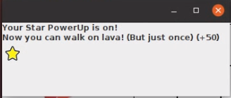

# Projeto Dino World
Jogo feito na disciplina de POO

# Estrutura de Arquivos e Pastas

~~~
├── README.md          <- apresentação do projeto
│
├── src                <- projeto em Java 
│   │
│   ├── src            <- arquivos-fonte do projeto (.java)
│   │
│   ├── bin            <- arquivos em bytecode (.class)
│   │
│   └── README.md      <- instruções básicas de instalação/execução
│
└── assets             <- mídias usadas no projeto
~~~

## `src`

Projeto em Java, incluindo todos os arquivos de dados e bibliotecas necessários para a sua execução. Dentro dessa pasta há uma subpasta `src` onde estão os fontes e outra subpasta `bin` onde estão os bytecodes.

 O arquivo `README.md` contém as instruções básicas de instalação e execução.

## `assets`

Mídias usadas no seu projeto: vídeo da execução do jogo, imagens da interface, slides de proposta de jogo e apresentação de destaques do código. 

# Projeto `Dino World`

# Descrição Resumida do Jogo

> O jogo Dino World 
 
 ## Regras
* O dino pode se movimentar 1 casa em qualquer direção: vertical, horizontal ou diagonal.
  Uma casa não pode ser ocupada por mais de um dino.
* O ovo deve ser capturado o mais rápido possível. Ele pode ser capturado em até 10 jogadas para receber alguma pontuação. A pontuação atribuída será 100 -  (jogada-1)*10. Capturar o ovo é uma condição imprescindível para ganhar o jogo. Então, deve ser capturado mesmo se não for em menos de 10 jogadas.
* O dino chega só pode capturar o ovo do seu filhote na rodada depois de chegar nele e só pode sair na seguinte.
* A cada jogada, uma célula conectada a um vulcão por outras lavas é ocupada por lava e o dino morre se passar por ela.
* Se a lava atingir uma surpresa, a supresa deixa de existir.
* Se o dino passar pela lava, sem o power up da estrela ativado, ele morre
* A caixinha de surpresas só é aberta uma vez, depois que o dino passa por ela, ela deixa de existir
* O dino não pode se mover para onde há um meteoro

## Surpresas do Jogo
No jogo há células de surpresas, que interferem no jogo de cada dino. 

**Surpresas**

item | detalhamento
----- | -----
Comida | +10 pontos
Pedra | -10 pontos
Estrela | permite que o dino passe sobre lava 1 vez <br> +50 potnos
Meteoro | o dino volta para a casa inicial <br> -20 pontos


 ## Como Jogar 
Instruções de como baixar e executar o jogo podem ser encontradas [aqui](src/README.md) . 

Primeiro, deve-se preencher os nomes desejados para os players. Depois, cada Dino deve 
clicar em uma seta na sua vez de jogar, lembrando nos objetivos e regras do jogo.
A ordem da rodada dos dinos por cor é: Vermelho, Marrom, Amarelo e Verde. 

Uma janela mostrará o vencedor no final do jogo.

# Equipe
* `Giovanna Gennari Jungklaus` - `198010`
* `Isabella Garcia Fagioli ` - `173174`

# Vídeos do Projeto

## Vídeo da Prévia
> [Vídeo](https://youtu.be/SdN0JPa0CSU)

## Vídeo do Jogo
> [Vídeo](https://www.youtube.com/watch?v=p1ehbMIuL-E)

# Slides do Projeto

## Slides da Prévia
[Slides](/assets/GameProposal.pdf)

## Slides da Apresentação Final
[Slides]()

## Relatório de Evolução

### Listeners de JButtons
Em um primeiro momento, as jogadas de cada usuário foram tratadas a partir de `chars`
lidos pelo terminal, pois não sabíamos como trabalhar com `Event Listeners` em `JButtons`
distribuídos em um `GridLayout`. 

Aqui mostra como tratamos uma jogada de exemplo: 

```java
 //receive move solicitation
String str = keyboard.nextLine();
char command = str.charAt(0);

int destinyX = 0, destinyY = 0;

//up
if (command == '8') {
    destinyX = dinos[i].getI() + 1;
    destinyY = dinos[i].getJ();
}
```

No entanto, estudamos como adicionar `Event Listeners` aos `JButtons`. Como no código:

```java
graphicInterface.getMenuBar().buttonUp.addActionListener(actionEvent -> {
    command = 8;
    click++;
});
```

Isso feito dentro do `Controle do Jogo` e não no construtor da `JToolbar`, pois era preciso
contabilizar a quantidade de cliques e saber quando um botão era clicado para executar 
o movimento do jogador da vez. O movimento foi executado como mostra o código:

```java
//up
if (command == 8) {
    destinyX = dinos[i].getI() - 1;
    destinyY = dinos[i].getJ();
}
```

Imagem dos `JButtons` como o jogador seguinte:


Notamos que quando um jogador morria no jogo, era necessário aumentar a variável de int que 
contabiliza os `Clicks`, mesmo sem haver um novo evento. 


# Destaques de Código

### Incrementação da Interface Gráfica

Ao executar o jogo algumas vezes, notamos percebemos detalhes que tornariam a experiência do usuário
mais agradável e intuitiva no jogo. Assim, adicionamos os seguintes à interface gráfica:

`Janelas PopUp`

Informar ao usuário qual surpresa foi sorteada através de pop up windows ao invés de apenas
  incrementar a pontuação no painel.
  
```java
if (s instanceof Meteor){
        message1 = new JLabel("A meteor was about to strike you.");
        message2 = new JLabel("Go back to the start. (-20)");
        icon = new JLabel(new ImageIcon(filePath.toString() + "/meteor.png"));
        }

```




`Dino na mesma célula do Ovo`

Mostrar quando o dino está na casa do seu ovo e deve chocá-lo, assim como mostrar nas suas infos se ele já o possui;


` Mostrar player seguinte abaixo dos botões de movimentação`

Mostrar na interface qual o próximo player a jogar.


### Uso de Hierarquia  

Usamos hierarquia para reconhecer surpresa, atualizar pontuação e mostrar surpresa na popup window 

Na interface `ISurprise` há o seguinte método:
```Java 
public int pointsToAdd();
```
O uso de hieraquia facilita a incremetação dos pontos de cada jogador, pois essa função é sobrescrita por aquelas que extendem a `Surprise`, como `Meteor`, `Food `Rock` e `StarPowerUp`, evitando uma verificação com ifs ou instâncias.


# Destaques de Pattern
`<Destaque de patterns adotados pela equipe. Sugestão de estrutura:>`

## Diagrama do Pattern
`<Diagrama do pattern dentro do contexto da aplicação.>`

### Model

Este é o diagrama compondo componentes para análise:


### View

Este é um diagrama inicial do projeto de jogos:


### Control

Este é outro diagrama de um projeto de vendas:


## Código do Pattern


> <Explicação de como o pattern foi adotado e quais suas vantagens, referenciando o diagrama.>

# Conclusões e Trabalhos Futuros

> Concluímos que uma boa interface gráfica é de suma importância para um jogo e entender sobre GUI foi importante para contruí-la. Além disso, trabalhar com 
eventos também não é uma tarefa fácil, mas esta é uma ótima ferramenta para obter inputs do jogador. O trabalho em grupo foi a chave para conseguirmos entender esses conceitos e aplicá-los. Por fim, se tivessemos mais tempo implementariamos um Bot para que o jogo pudesse ser jogado em menos de 4 pessoas. Além disso, também aumentariamos o encapsulamento do jogo, evitando fazer verificações diretas sobre as células em classes fora do tabuleiro. De modo geral, ficamos muito contentes com o resultado, mas ainda faríamos essas melhorias.>

# Documentação dos Componentes

# Diagramas

## Diagrama Geral do Projeto (UML gerado pelo IntelliJ)

 

Este é um diagrama UML gerado pelo IntellJ. 
As caixas com um C em verde indicam as classes utilizadas e as com um I em azul indicam 
as interfaces para fazer a comunicação entre classes. 
Tentamos adotar um modelo Model-View-Control. 

A classe `AppDinoWorld` instancia um `Control`, que por sua vez instancia
um `Builder`, responsável pela criação do modelo de tabuleiro
adotado no jogo, e uma `GraphicInterface`, que apresenta o tabuleiro e 
suas atualizações a pedido do controle.  

## Diagrama Geral de Componentes


Para cada componente será apresentado um documento conforme o modelo a seguir:

## Componente `ControlP`

> O `ControlP` é onde ocorre toda a base do jogo. Nele, chamamos o 
> `builder` para contruirmos nosso tabuleiro e atores,
> rodamos todo o príncipio de lógica do jogo e chamamos a
> interface gráfica a cada atualização


**Ficha Técnica**

item | detalhamento
----- | -----
Classe | `ControlP.Control` <br> `ControlP.TextFieldEvent`
Autores | `Isabella Fagioli e Giovanna Gennari`
Interfaces | `IControl`

### Interfaces

Interfaces associadas a esse componente:


Interface agregadora do componente em Java:

~~~java
public interface IDataSet extends ITableProducer, IDataSetProperties {
}
~~~

## Componente `Board`

> `Board` é onde o jogo acontece. É o espaço celular onde ocorrem as movimentações.
> 


**Ficha Técnica**

item | detalhamento
----- | -----
Classe | `Board.Board` 
Autores | `Isabella Fagioli e Giovanna Gennari`
Interfaces | `Board.IBoard`

### Interfaces

Interfaces associadas a esse componente:


Interface agregadora do componente em Java:

~~~java
public interface IDataSet extends ITableProducer, IDataSetProperties {
}
~~~

## Componente `Cell`

> Cada célula do jogo possui indicações do que há dentro. Se há um dino, uma lava, 
> `Cell` é quem controla isso


**Ficha Técnica**

item | detalhamento
----- | -----
Classe | `Cell.Cell` <br> `Cell.Surprise` <br> `Cell.Volcano` <br> `Cell.Food` <br> `Cell.Meteor` <br> `Cell.StarPowerUp` <br> `Cell.Rock`
Autores | `Isabella Fagioli e Giovanna Gennari`
Interfaces | `ICell, ISurprise, IVolcano`

### Interfaces

Interfaces associadas a esse componente:


Interface agregadora do componente em Java:

~~~java
public interface IDataSet extends ITableProducer, IDataSetProperties {
}
~~~

## Componente `Actor`

> Nossos atores são os dinos. Eles têm controle sobre as posições de chegada e de ovo, e são responsáveis por
> guardarem seus estados, se estão vivos, sua pontução, se possuem PowerUp, etc.
> 


**Ficha Técnica**

item | detalhamento
----- | -----
Classe | `Actor.Actor`
Autores | `Isabella Fagioli e Giovanna Gennari`
Interfaces | `Actor.IActor`

### Interfaces

Interfaces associadas a esse componente:


Interface agregadora do componente em Java:

~~~java
public interface IDataSet extends ITableProducer, IDataSetProperties {
}
~~~

## Componente `Builder`

> `Builder` é o que constrói o nosso jogo. Ele define as localizações iniciais de tudo no tabuleiro e os estados
> de jogo e dos dinos no começo


**Ficha Técnica**

item | detalhamento
----- | -----
Classe | `Builder.Builder` 
Autores | `Isabella Fagioli e Giovanna Gennari`
Interfaces | `Builder.IBuilder`

### Interfaces

Interfaces associadas a esse componente:


Interface agregadora do componente em Java:

~~~java
public interface IDataSet extends ITableProducer, IDataSetProperties {
}
~~~

## Componente `BoardView`

> <`BoardView é responsável pela nossa interface gráfica, por mostrar o tabuleiro com imagens e atualizar
> sua representação a cada modificação`>
>


**Ficha Técnica**

item | detalhamento
----- | -----
Classe | `BoardView.BoardView` <br> `BoardView.DinoInfo` <br> `BoardView.GraphicInterface` <br> `BoardView.MenuBar`
Autores | `Isabella Fagioli e Giovanna Gennari`
Interfaces | `IGraphicInterface`

### Interfaces

Interfaces associadas a esse componente:


Interface agregadora do componente em Java:

~~~java
public interface IDataSet extends ITableProducer, IDataSetProperties {
}
~~~


## Detalhamento das Interfaces

Getters e Setters foram omitidos nas tabelas descrevendo os métodos das interfaces, mas foram implementados 
para todos os atributos de suas respectivas classes quando necessário.

### Interface `IControl`

`Interface com as funções do Control além de conectar as classe deste componente com os outros`

```java
public interface IControl {
    public void executeGame(String[] names);

    public void connect(IBoard board);
    public void connect(int idx, IActor actor);
    public void connect(int idx, IVolcano v);
    public boolean atLeastOneAlive();
    public IGraphicInterface getGraphicInterface( );
    public IActor[] getDinos();
}
```

Método | Objetivo
-------| --------
`public void executeGame(String[] names)` | Pega os nomes dos dinos e executa o jogo com os dinos
`public void connect(IBoard board)`| Conecta ao tabuleiro
`public void connect(int idx, IActor actor)` | Coloca ator pego no Board 
 em um `IActor[]`
`public boolean atLeastOneAlive()` | Verifica se tem pelo menos um dino vivo


### Interface `IBoard`

`Contém os métodos responsáveis pelas ações do tabuleiro e pelas suas cinexões com
outros componentes`

```java
public interface IBoard {
    public void move(IActor dino, int destinyX, int destinyY);
    public boolean validatesMove(int destinyX, int destinyY);
    public void insertLavas(IVolcano[] volcanoes);
    public boolean captureEgg(IActor dino);
    public void updateBoard(boolean capturedEgg, boolean surpriseUsed, int destinyX, int destinyY);
    public void connect(char character, boolean value, int i, int j);
    public void connect(IActor actor, int i, int j);
    public void connect(ISurprise surprise, int i, int j);
    public void connect(IVolcano volcano, int i, int j);
    public ICell[][] getCellsSpace();
    public boolean verifySurprise(int destinyX, int destinyY);
}
```

Método | Objetivo
-------| --------
`public void move(IActor dino, int destinyX, int destinyY)` | Faz movimentação do ator, verificando se a posição de destino contém surpresa ou lava para executar suas implicações
`public boolean validatesMove(int destinyX, int destinyY)`| Garante que a movimentação está dentro dos limites tabuleiro e não avança para uma casa inválida, como Volcano ou Meteor
`public void insertLavas(IVolcano[] volcanoes)`| Insere uma lava, conforme a posição sugerida pelao método `nextLava()` do `IVolcano`, para cada vulcão no tabuleiro no final de cada rodada
`public boolean captureEgg(IActor dino)` | Verifica se o ator capturou o ovo e remove-o do tabuleiro 
`public void updateBoard(boolean capturedEgg, boolean surpriseUsed, int destinyX, int destny)` | Atualiza tabuleiro removendo surpresas abertas e ovos capturados
`public void connect(char character, boolean value, int i, int j)`| Atualiza booleanos para conter ovo e forte em uma posição do tabuleiro
`public void connect(IActor actor, int i, int j)`|  Conecta actor em sua respectiva posição do tableiro
`public void connect(ISurprise surprise, int i, int j)`|  Conecta surpresa em sua respectiva posição do tableiro
`public void connect(IVolcano volcano, int i, int j)`| Conecta vulcão em sua respectiva posição do tableiro
`public ICell[][] getCellsSpace()`| Retorna a matriz de células do tabuleiro para verificações fora da classe
`public boolean verifySurprise(int destinyX, int destinyY)`| Verifica qual é o tipo da surpresa aberta pelo ator 

### Interface `ICell`

`Contém todos os métodos relacionados a cada célula do tabuleiro`

```java
public interface ICell {
    public boolean getHasEgg();
    public boolean getHasLava();
    public boolean getHasMeteor();
    public boolean getHasFort();
    public void setHasEgg(boolean value);
    public void setHasLava(boolean value);
    public void setHasMeteor(boolean value);
    public void setHasFort(boolean value);
    public ISurprise getSurprise();
    public void setSurprise(ISurprise surprise);
    public IActor getDino();
    public void setDino(IActor dino);
    public IVolcano getVolcano();
    public  void setVolcano(IVolcano v);
    public void connectSurprise(ISurprise value);
    public void connectVolcano(IVolcano value);
}
```

Método | Objetivo
-------| --------
`public void connectSurprise(ISurprise value)`| Conecta surpresa em uma célula a pedido do tabuleiro
`public void connectVolcano(IVolcano value)`| Conecta vulcão em uma célula a pedido do tabuleiro

### Interface `ISurprise`

`Contém os métodos das surpresas`

```java
public interface ISurprise {
    public int pointsToAdd();
    public int getValue();
    public void connect(ISurprise surprise);
}
```

Método | Objetivo
-------| --------
`public int pointsToAdd()`| Adiciona os pontos da surpresa tirada
`public int getValue()`| Pega o valor da surpresa tirada
`public void connect(ISurprise surprise)`| Conecta a surpresa

### Interface `IVolcano`

`Contém os métodos relacionados às ações dos vulcões, como a adição de lavas a cada rodada`

```java
public interface IVolcano {
    public int[] nextLava(Board b);
    public void connect(IBoard board);
}
```

Método | Objetivo
-------| --------
`public int[] nextLava(Board b)` | Sorteia a posição onde a próxima lava deve ser colocada
`public void connect(IBoard board)` | Conecta o tabuleiro

## Interface `IActor`

`Referente aos dinos, suas ações e conexões com os demais componentes`

```java
public interface IActor {
    public void setI(int value);
    public void setJ(int value);
    public int getI();
    public int getJ();
    public void setEggPos();
    public void setFortPos();
    public int getEggX();
    public int getEggY();
    public int getFortX();
    public int getFortY();
    public int getScore();
    public boolean getHasEgg();
    public boolean getIsAlive(IBoard b);
    public boolean getStarPowerUpOn();
    public boolean getHasWon();
    public String getName();
    public void setHasEgg(boolean value);
    public void setIsAlive(boolean value);
    public void setStarPowerUpOn(boolean value);
    public void setHasWon(boolean value);
    public void updateScore(int value);
    public void setName(String name);
    public void setInitialI(int initialI);
    public void setInitialJ(int initialJ);
    public int getInitialI();
    public int getInitialJ();
    public boolean isSurrounded(int x, int y, IBoard board);
}
```

Método | Objetivo
-------| --------
`public void updateScore(int value)` | Atualiza a pontuação do jogador
`public boolean isSurrounded(int x, int y, IBoard board)` | Verifica se a posição está cercada por lava

## Interface `IBuilder`

`Realiza as ações de construir o tabuleiro jogo com seus respectibos elementos`

```java
public interface IBuilder {
    public void newBoard(IControl control);
}
```

Método | Objetivo
-------| --------
`public void newBoard(IControl control)` | `Cria o tabuleiro e tudo dentro dele, incluindo os dinos`

## Interface `IGraphicInterface`

`Referente à  interface gráfica do jogo`

```java
public interface IGraphicInterface {
    public void connect(IBoard b);
    public void connect(IActor[] dinos);
    public JFrame getF();
    public void printGame();
    public MenuBar getMenuBar();
    public void setMenuBar(MenuBar menuBar);
    public BoardView getBoardView();
    public void updateBoardView( int next);
}
```

Método | Objetivo
-------| --------
`public void connect(IBoard b)` | Conecta o tabuleiro
`public void connect(IActor[] dinos)` | Conecta os atores
`public void printGame()` | Mostra o jogo na tela com todas as imagens
`public void updateBoardView(int next)` | Mostra o estado atual do jogo


# Plano de Exceções

As exceções foram tratadas dentro das verificações internas na lógica de execução do jogo. 

### JTextField e DefaultValues para nome dos Players
